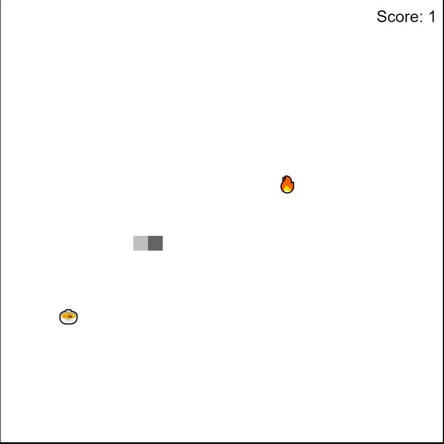
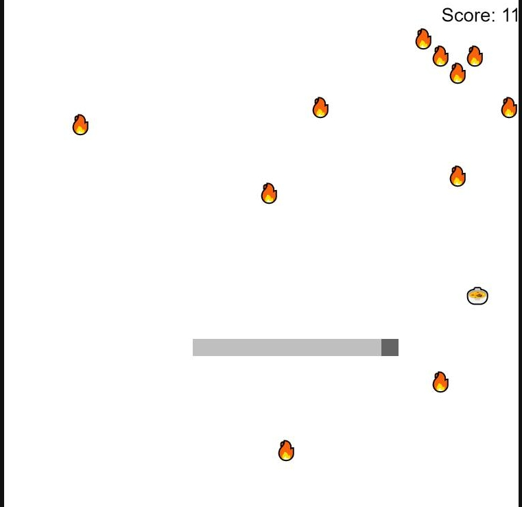
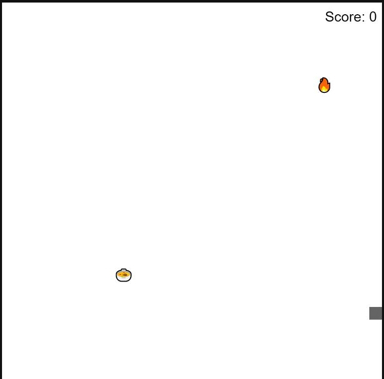

# Snake Game II

# About

This project is a snake game that is built with HTML, CSS, and JavaScript in Visual Studio Code.

To start the game the user tap on the arrow keys to move the snake

The snake will automatically move in the direction it is facing when the game starts

The user can move the snake left or right using the left or right button in the keyboard

The user can move the snake up or down using the up or down button in the keyboard

When the snake eats the food, the food will add itself to the snake and the score will increase by 1 point

When the snake eats the poison the snake will decrease back to one block and the score will revert back to zero,forcing the user to start the game again.
                       
The poisons will disappear and reappear randomly on the screen

The snake is able to stop its movement by being placed on the ends of the screen                     where there is no poison or food present

# Documentation

HTML and CSS is used to create the screen of the web based application

JavaScript classes are used for the Snake, food, and poison

JavaScript functions are used to create the board, the snake's action of eating the food and posion, scoreboard, and movement of the snake.

# Result when the user is starts the game

# Result when the user is playing the game

# Result when the snake eats the poison

 
